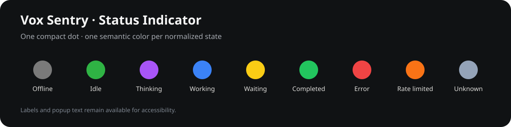
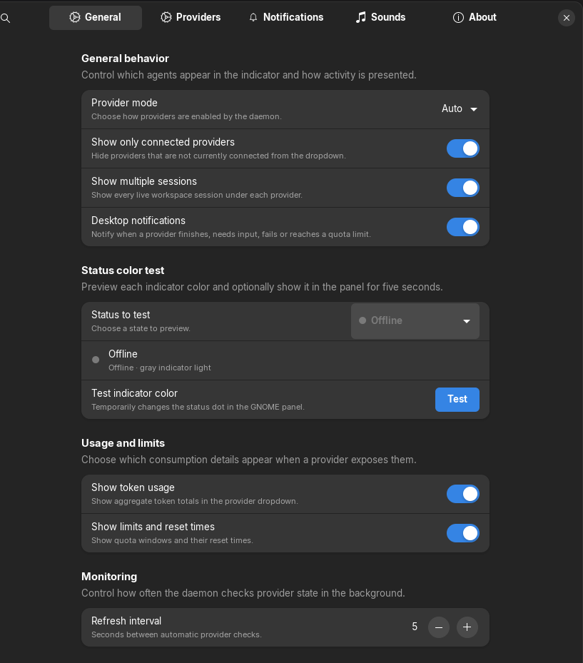
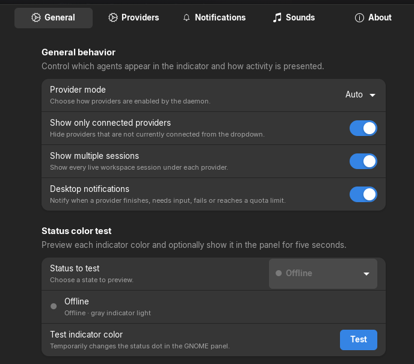
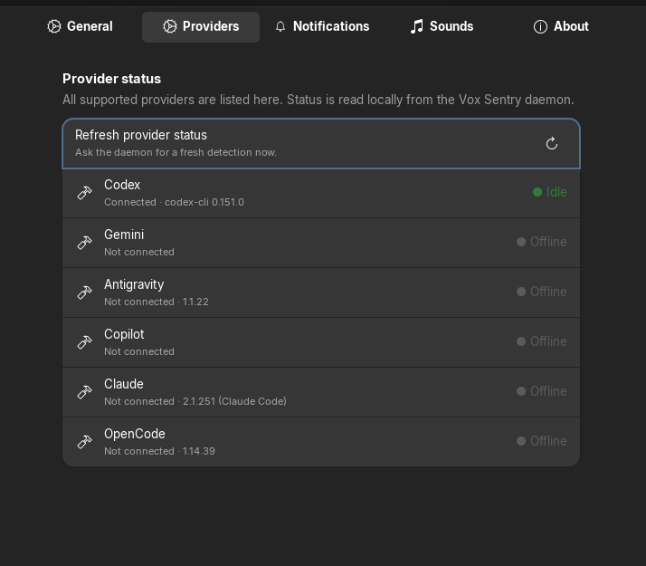
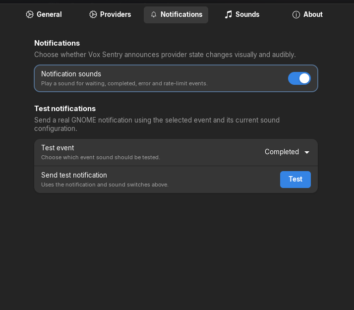
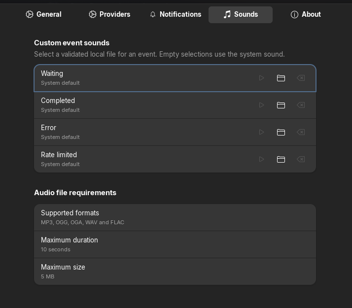
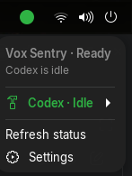
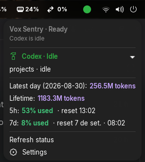

# gnome-vox-sentry




Project repository: https://github.com/waltenne/gnome-vox-sentry

Vox Sentry is a local-first, privacy-first sentry for coding agents running on Linux/GNOME. It
discovers agents, normalizes their state and presents a discreet top-bar indicator. Codex, Gemini,
Antigravity, Copilot, Claude and OpenCode are supported providers; the Core, protocol, daemon and
GNOME client are provider-neutral.

The project is distributed under the GNU GPL-2.0-or-later; see [LICENSE](LICENSE).

## Table of contents

- [Overview](#overview)
- [Status indicator](#status-indicator)
- [Screenshots](#screenshots)
- [Current status and roadmap](#status)
- [Runtime flow](#runtime-flow)
- [GNOME compatibility](#gnome-compatibility)
- [Installation and quick start](#installation-and-quick-start)
- [GitHub and EGO release flow](#github-and-ego-publication-flow)
- [Configuration](#configuration)
- [Notifications and audio](docs/notifications.md)
- [Architecture and protocol](docs/architecture.md)
- [Providers](docs/providers.md)
- [Development and testing](docs/development.md)
- [Performance](docs/performance.md)
- [Release guide](docs/releasing.md)
- [Privacy and security](#privacy-and-security)
- [License](LICENSE)

For the complete documentation map, see [docs/README.md](docs/README.md).

## Overview

Vox Sentry keeps the signal in the GNOME top panel minimal: one centered dot identifies the
aggregated state, while the popup provides provider names, session details, usage and reset times.
The dot changes directly with the normalized state; it does not use a three-color traffic-light
grouping. The complete color sequence is available in the [status palette](docs/assets/status-palette.svg)
and the animated [status demo](docs/assets/status-demo.gif).

The demo is generated locally with `scripts/generate-status-demo.sh` when ImageMagick is available.
It is intentionally provider-neutral: actual provider state continues to be detected by the daemon
and normalized before the GNOME extension renders it.

## Status indicator

The indicator uses one circular dot and preserves a text label in the popup, so color is never the
only way to identify a state:

| Normalized state | Color | Meaning |
| --- | --- | --- |
| `OFFLINE` | Gray | Provider or local monitor unavailable |
| `IDLE` | Green | Provider is ready |
| `THINKING` | Purple | Provider is planning |
| `WORKING` | Blue | Provider is processing |
| `WAITING` | Yellow | Provider needs input |
| `COMPLETED` | Bright green | Last task completed |
| `ERROR` | Red | Provider reported an error |
| `RATE_LIMITED` | Orange | Usage limit was reached |
| `UNKNOWN` | Blue-gray | State could not be determined |

## Screenshots

These screenshots show the development build running with the GNOME dark theme. The configuration
window uses the native Adwaita layout, while the panel captures show the compact indicator and its
provider/usage popup.

<details open>
<summary>Configuration window</summary>

### General





### Providers



### Notifications



### Sounds



</details>

<details open>
<summary>Running indicator</summary>





</details>


## Status

The initial implementation is complete and usable as a local GNOME monitor. It detects Codex
CLI/VS Code, Gemini CLI/VS Code, Antigravity, GitHub Copilot, Claude Code and OpenCode processes,
and reports process, PID, workspace and session metadata. Activity is inferred from provider-local
session metadata and live process state. Codex and Antigravity expose authenticated usage and
rate-limit windows when their accounts permit it. The UI never fabricates unavailable values, so
providers without a stable usage source are shown as unavailable.

## Implementation roadmap

### Completed

- **Core and daemon** — Provider-neutral models, status aggregation, protocol v1, D-Bus service,
  CLI, XDG configuration and a systemd user service.
- **Provider monitoring** — Codex, Gemini, Antigravity, Copilot, Claude Code and OpenCode
  discovery, workspace/session tracking and conservative status detection. Multiple simultaneous
  sessions are supported, including multiple Codex chats.
- **Usage and limits** — Authenticated Codex app-server usage plus Antigravity's structured
  `agy /usage` output, including 5-hour/weekly windows, percentages and reset timestamps. Usage
  is cached and omitted when the provider cannot verify it.
- **GNOME interface** — System-theme-aware compact status dot, provider icons, semantic per-status
  colors, expandable provider dropdowns, connected-provider filtering and an in-extension
  Preferences window organized by configuration tabs.
- **Notifications and audio** — Provider-specific status notifications with transition
  debouncing, desktop notification settings, per-event sounds, preview/testing and system
  fallback. MP3, OGG, OGA, WAV and FLAC are validated by content/MIME/header/integrity/duration/
  decoder checks with shared 10-second and 5 MB limits.
- **Quality and publication** — Automated CI, Python/JavaScript/Shell checks, memory and CPU
  review, GPL-2.0-or-later licensing, EGO package allowlisting, `shexli` validation and a tagged
  GitHub release workflow.

### Next implementation phases

- **Provider usage expansion** — Add verified usage/limit sources for Gemini, Copilot, Claude Code
  and OpenCode when their local runtimes expose stable, documented data, without scraping prompts
  or inventing quotas.
- **Provider adapter API** — Define a versioned adapter contract for third-party providers and
  custom integrations while preserving the normalized Core model.
- **Event and diagnostics improvements** — Expand provider-native event watching, expose clearer
  authentication/quota diagnostics and improve recovery when a provider restarts or changes its
  local storage format.
- **Client expansion** — Evaluate Waybar, KDE, TUI and JetBrains clients after the GNOME/D-Bus
  contract is stable.

The detailed milestone history remains available in [docs/roadmap.md](docs/roadmap.md), while
release-specific checks are documented in [docs/releasing.md](docs/releasing.md).

## Runtime flow

Vox Sentry keeps provider discovery and heavier work outside GNOME Shell:

```text
CLI/IDE process
      ↓
Provider adapter (status, sessions and verified usage)
      ↓
Vox Sentry Core (normalization and aggregation)
      ↓
vox-sentryd (adaptive refresh and failure isolation)
      ↓
D-Bus session bus
      ↓
GNOME indicator → provider dropdown / notifications
                         ↓
                    Sound Manager → GStreamer
```

The daemon refreshes local provider state, publishes protocol v1 JSON through D-Bus and emits
provider-specific status changes. The extension consumes that snapshot, displays only verified
values and cleans up its timers, signals and D-Bus calls when disabled. Usage requests are cached;
an unavailable or unauthorized quota source is shown as `Unavailable`.

## GNOME compatibility

The extension currently supports and declares **GNOME Shell 46** only (`shell-version: ["46"]`).
This is the only version included in the package metadata and the only version currently validated
for publication. Do not add another GNOME version until it has been tested in a clean session.

The daemon and CLI require Python 3.10 or newer. Notification playback requires the GNOME/Linux
GStreamer runtime and the codecs for the selected sound format.

## Layout

```text
vox_sentry/              normalized models, registry, aggregation, protocol, daemon and CLI
providers/codex/         Codex discovery, sessions and usage translation
providers/gemini/        Gemini CLI/VS Code discovery and session translation
providers/antigravity/   Antigravity process-tree translation and Cloud Code quota usage
providers/copilot/       GitHub Copilot CLI/VS Code discovery
providers/claude/        Claude Code CLI/IDE discovery
providers/opencode/      OpenCode CLI/server and local session translation
gnome-extension/         GJS indicator, Preferences, notifications and Sound Manager
vox_sentry/sound.py      shared audio validation policy and test/CLI boundary
tests/                   provider, audio validation and Codex boundary tests
docs/                    architecture, protocol and contributor guides
systemd/                 user service
```

## Installation and quick start

```bash
python3 -m venv --system-site-packages .venv
. .venv/bin/activate
pip install -e '.[dev]'
pytest
python -m vox_sentry.daemon --once
vox-sentry status
vox-sentry status --json
vox-sentry sessions
vox-sentry providers
```

For a user installation, run `./install.sh`. It creates an isolated virtualenv at
`~/.local/share/gnome-vox-sentry/venv`, installs the CLI/daemon there, installs the extension and
user systemd unit, and avoids the PEP 668 `externally-managed-environment` error found on Debian and
Ubuntu. It also adds `vox-sentry` and `vox-sentryd` symlinks under `~/.local/bin`.

Notification sound playback uses the GNOME/Linux GStreamer stack. On Debian/Ubuntu systems, make
sure the base introspection data and Good plugins are installed so OGG, OGA, WAV, FLAC and MP3
decoders are available:

```bash
sudo apt install gir1.2-gst-plugins-base-1.0 gstreamer1.0-plugins-good
```

Start `vox-sentryd` in a GNOME session for D-Bus clients. The daemon uses
`io.github.gnome_vox_sentry` and object `/io/github/gnome_vox_sentry`. Install the systemd unit to
`~/.config/systemd/user/`, run `systemctl --user daemon-reload`, then
`systemctl --user enable --now vox-sentryd`.

Enable the panel indicator with:

```bash
gnome-extensions enable vox-sentry@gnome-vox-sentry
```

GNOME Shell discovers user extensions at session startup. On Wayland, log out and back in once
after installation if `gnome-extensions` reports that the UUID does not exist.

To create the reviewable EGO bundle, use the explicit extension-only allowlist:

```bash
./pack-ego.sh dist
unzip -t dist/vox-sentry@gnome-vox-sentry.shell-extension.zip
```

The ZIP contains only the GJS extension, Preferences client, notification/sound modules,
stylesheet, GSettings XML and the project license. The daemon and its Python providers remain a separately installed
local prerequisite. See [docs/gnome/ego-review-checklist.md](docs/gnome/ego-review-checklist.md) and
[docs/gnome/ego-blockers.md](docs/gnome/ego-blockers.md) before submitting to EGO.

## GitHub and EGO publication flow

The repository uses two GitHub Actions workflows:

1. `ci.yml` runs on pushes to `main` and pull requests. It executes Python tests/linting, JavaScript
   and GJS checks, ShellCheck, multimedia validation and EGO package inspection.
2. `release.yml` runs for an annotated `vMAJOR.MINOR.PATCH` tag. It requires the tag version to
   match `pyproject.toml`, repeats the checks, builds the extension-only ZIP, generates a SHA-256
   checksum and publishes both as a GitHub Release.

The final EGO upload is manual. After the release workflow succeeds, upload the generated
`vox-sentry@gnome-vox-sentry.shell-extension.zip` at
[extensions.gnome.org/upload](https://extensions.gnome.org/accounts/login/?next=/upload/), select
only the GNOME Shell versions actually tested and complete the maintainer confirmations. The
workflow never stores GNOME credentials or uploads to EGO automatically.

## Configuration

Configuration is JSON at `$XDG_CONFIG_HOME/gnome-vox-sentry/config.json` (normally
`~/.config/gnome-vox-sentry/config.json`). Data and cache paths are respectively under
`$XDG_DATA_HOME` and `$XDG_CACHE_HOME`. The default is `providerMode: auto`; `manual` and `multi`
are supported.

The GNOME Preferences window uses a native Adwaita sidebar with five categories:

| Category | Settings |
| --- | --- |
| General | Provider mode, session display, usage, limits, status color test and refresh interval |
| Providers | Live connection, detected version and status diagnostics for every provider |
| Notifications | Desktop notifications and notification simulation |
| Sounds | Per-event audio, preview and validated format requirements |
| About | Version, GNOME compatibility, privacy, repository and license |

The main configuration keys are `providerMode`, `providers.<id>.enabled`,
`monitoring.refreshInterval`, `notifications.enabled`, `notifications.events` and the GNOME
settings keys for display, usage and sounds. The extension settings are stored by GSettings under
`org.gnome.shell.extensions.vox-sentry`; the daemon configuration remains in its XDG JSON file.
The default provider mode is `auto`, connected-provider filtering is enabled and all notification
events are enabled.

```bash
vox-sentry provider use auto
vox-sentry provider use codex
vox-sentry provider use gemini
vox-sentry provider use antigravity
vox-sentry provider use copilot
vox-sentry provider use claude
vox-sentry provider use opencode
vox-sentry provider use multi
vox-sentry provider enable codex
vox-sentry provider disable codex
```

In `auto` mode, all detected providers are monitored. The GNOME menu identifies live sessions by
provider and workspace. “Working” means a recent provider session update or an active agent process
was observed; an open interactive CLI is reported as “Idle” until it begins updating its local
session state.

The GNOME Preferences window includes a connected-provider filter, live status diagnostics and
notification sound settings. Custom sounds officially support MP3, OGG, OGA, WAV and FLAC. Every
format uses the same maximum duration of 10 seconds and maximum size of 5 MB. Files are checked by
MIME type, magic bytes, integrity, duration and actual decoder availability; the MP3 path uses
GStreamer and is not experimental.

## Documentation by topic

| Topic | Guide | What it explains |
| --- | --- | --- |
| Installation | [Installation guide](docs/installation.md) | Requirements, daemon, extension, package and troubleshooting |
| Configuration | [Configuration](docs/configuration.md) | Preferences tabs, GSettings and daemon JSON |
| Notifications | [Notifications and sounds](docs/notifications.md) | Events, MP3/audio validation, limits and fallback |
| Architecture | [Architecture](docs/architecture.md) and [Protocol v1](docs/protocol.md) | Provider-to-D-Bus-to-GNOME data flow |
| Providers | [Provider overview](docs/providers.md) | Built-in adapters and usage capabilities |
| Development | [Development](docs/development.md) and [Creating a provider](docs/creating-provider.md) | Local checks and extension points |
| Performance | [Performance](docs/performance.md) and [Memory audit](docs/performance-memory.md) | CPU, refresh, memory and stress results |
| Publication | [Release guide](docs/releasing.md) and [EGO checklist](docs/gnome/ego-review-checklist.md) | Tagging, package validation and GNOME submission |

## Privacy and security

No telemetry is implemented. The Codex provider reads executable/process metadata and only rollout
metadata/event types; prompts, answers, source code, file contents and credentials are not
transmitted or logged. Usage is requested from the local authenticated Codex app-server and only
the aggregate values needed by the indicator are retained. The daemon is local and the session bus
name is not a network API.

## Official Codex basis

The official Codex CLI documentation describes local repository work, `codex exec`, saved sessions
and the App Server. The App Server exposes JSON-RPC thread events and account rate-limit methods but
is experimental; the investigation and maturity table are in
[docs/codex-provider.md](docs/codex-provider.md).

See [docs/development.md](docs/development.md), [docs/creating-provider.md](docs/creating-provider.md)
and [docs/protocol.md](docs/protocol.md) for contributors and client authors. See
[docs/releasing.md](docs/releasing.md) for the tagged release workflow and the
extensions.gnome.org upload procedure.

Performance measurements and the provider performance contract are documented in
[docs/performance.md](docs/performance.md), with the memory ownership audit in
[docs/performance-memory.md](docs/performance-memory.md). Contribution and security guidance are in
[CONTRIBUTING.md](CONTRIBUTING.md) and [SECURITY.md](SECURITY.md).
